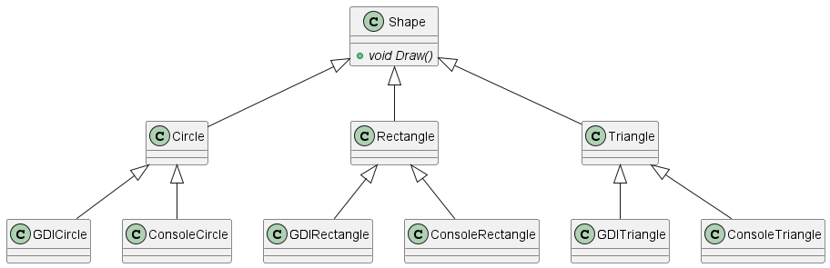

# Drawing
## Introduction
We've made a library that defines a set of shapes. The program must be able to run with any user interface.
The current structure looks like this:

### Exercise 1
What are the drawbacks of the design?
What design pattern would you recommend and why?
### Exercise 2
Open [Starter/Drawing.sln](/Starter/Drawing.sln). 
Try to implement the design pattern.

