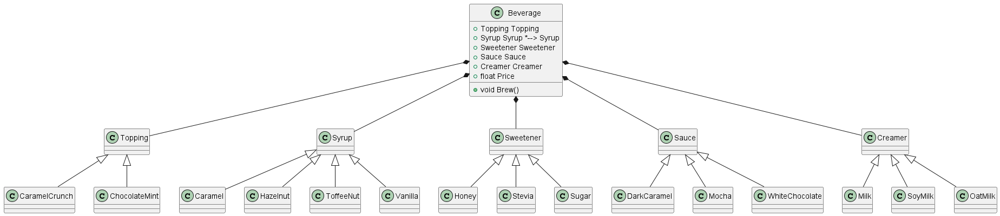

# Making Coffee
## Introduction
For a fictive company ACMEBucks we've got an assignment to create a coffee configurator for their drinks.
Drinks can have several ingredients and additions. We came up with the current solution. 

It works but has serious issues.
### Exercise 
What are the issues with the current implementation?
### Exercise 2
What design pattern would you recommend instead and why?
### Exercise 3
Open [Starter/Exercise5.sln](/Starter/Exercise5.sln).
Try to implement the design pattern.

